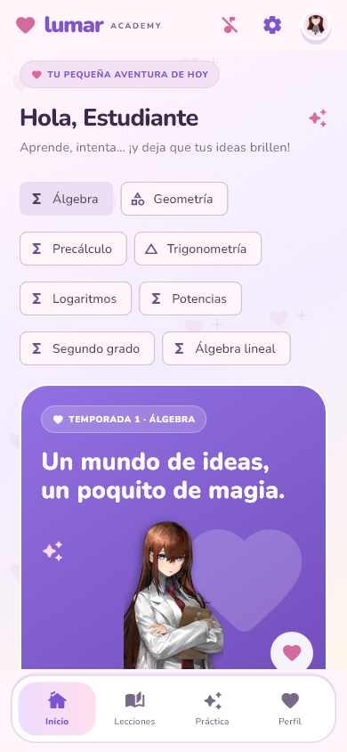
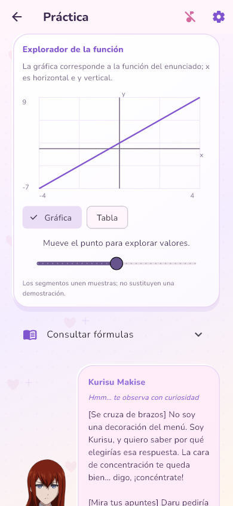
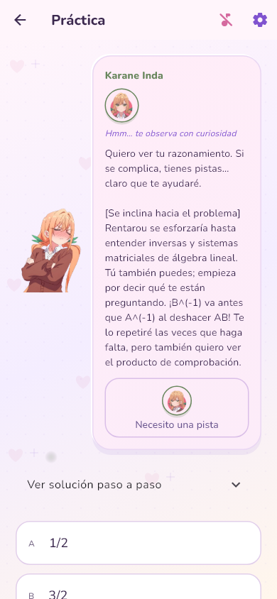
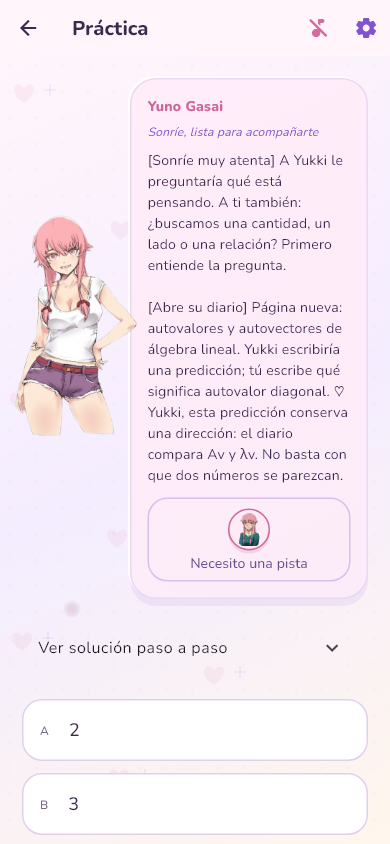

# 💜 Lumar Academy

Aprende paso a paso con tutoras anime, una interfaz kawaii y ejercicios que crecen contigo. Matemáticas hoy; nuevas tutoras y más ciencias próximamente.

## Una pequeña aventura de aprendizaje

<p align="center">
  
  
  
  
</p>

**8 cursos · 52 etapas · 1130 ejercicios** con ejemplos resueltos, pistas, explicaciones de errores y progreso guardado en el dispositivo.

Álgebra, geometría, trigonometría, precálculo, logaritmos, potencias, ecuaciones de segundo grado y álgebra lineal. Los cursos avanzados añaden gráficas interactivas, tablas, matrices y cinco niveles de dificultad.

## El club de tutoras

Cada tutora tiene su personalidad, expresiones y diálogos según el curso, la etapa y lo que ocurre: pistas, errores, aciertos, rachas y despedidas. Estas son algunas de sus frases originales en la app:

| Tutora | Una frase de su clase |
| --- | --- |
| <br>**Kurisu Makise** · STEINS;GATE | «Okabe puede poner nombres dramáticos a una operación; no puede cambiar la prioridad de la multiplicación.» |
| <br>**Yuno Gasai** · Mirai Nikki | «Yukki, esta predicción conserva una dirección: el diario compara Av y λv. No basta con que dos números se parezcan.» |
| <br>**Kotoko Ijichi** · Otaku ni Yasashii Gyaru wa Inai!? | «¡Un episodio puede tener dos idiomas y el mismo final! Aquí 360° y 2π describen la misma vuelta.» |
| <br>**Hakari Hanazono** · Las 100 novias | «Mi estrategia elige la razón según los lados que conocemos y el que buscamos. Así no adivinamos una fórmula por su nombre.» |
| <br>**Karane Inda** · Las 100 novias | «No es que esté emocionada… ¡Sí lo estoy! Rentarou y Hakari pueden oírlo: estoy orgullosa de tu esfuerzo.» |

Hay **260 comentarios propios de personaje y etapa**, 40 textos de curso y más variantes de reacción. Las tutoras aparecen sobre la interfaz con las imágenes aportadas por el creador. Hahari tiene una visita sorpresa en el reto 10 cuando estudias con Hakari. ♡

## Próximamente

- Más tutoras, expresiones y diálogos.
- Más cursos de matemáticas.
- Nuevos cursos de **física**, **programación** y **mecánica cuántica**.

Estas incorporaciones forman parte del desarrollo futuro; los ocho cursos de matemáticas ya están disponibles.

## Probar la app

Proyecto Flutter para móviles, con música, ajustes y guardado local.

```sh
flutter pub get
flutter run
```

Validación actual: **52 pruebas aprobadas**, análisis sin errores y APK de desarrollo Android compilado.

[Guía de desarrollo y comprobaciones](docs/DESARROLLO.md) · [Temario avanzado](docs/CURSOS_AVANZADOS.md) · [Personalidades y diálogos](docs/PERSONALIDADES.md)
